# 一、不修改程序，怎么能读不同的数据文件
1.根据"课程目标达成情况报告"页帧获取所需读取数据信息。在数据不规范时，通过日志抛出异常。
2.程序的健壮性。通过测试提升程序的健壮性。
# 二、测试数据应包含正确数据，也要包含不一致数据的组合，每个同学要设计不同数据的组合，测试你的程序
## 1.数据库原理及应用课程目标达成情况-updata4.xls表格
    （1）**修改**：增加了课程目标5；删除了达成度（教师评价法）
    （2）**测试结果**：
        程序正常运行并计算出结果。
        数据正确性测试运行通过。数据有不一致情况，主要因为精度问题导致不一致。
## 2.数据库原理及应用课程目标达成情况-updata3.xls表格
    （1）**修改**：增加了课程目标5；增加了编程考核方式；增加了4班；删除了达成度（教师评价法）
    （2）**测试结果**：
        程序正常运行并计算出结果。
        数据正确性测试程序运行通过。数据有不一致情况，主要因为精度问题导致不一致。
# 三、测试不同数据情况，学习使用log日志的用法
## 1."数据库原理及应用课程目标达成情况-updata4.xls表格"测试结果使用日志输出
   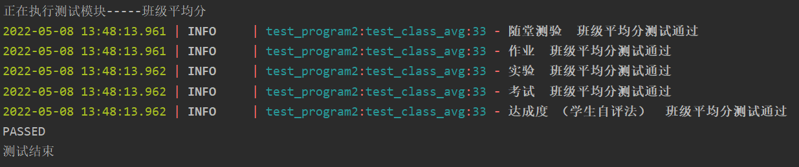
   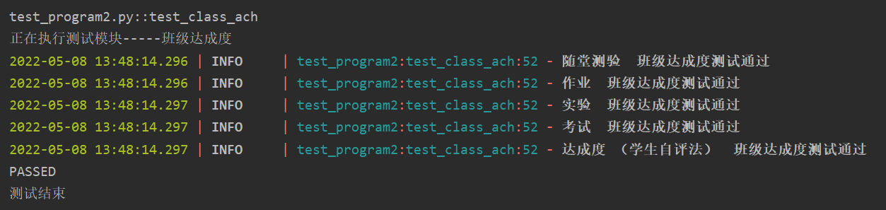
   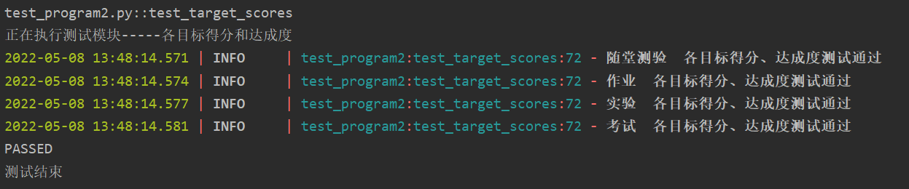
   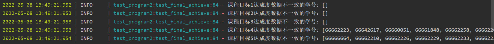
   
   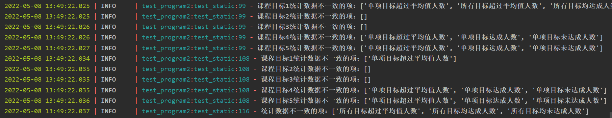
## 2."数据库原理及应用课程目标达成情况-updata3.xls表格"测试结果使用日志输出
   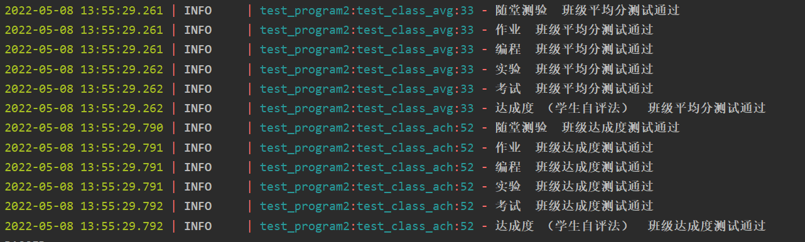
   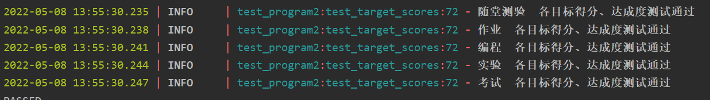
   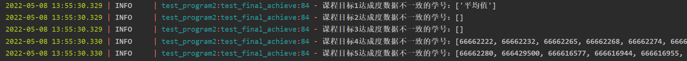
   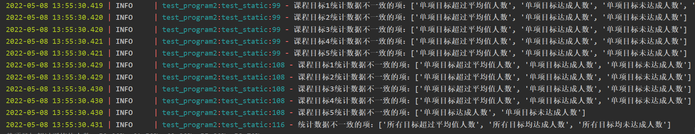

# 四、每位同学测试其他10位同学的测试数据，记录程序出现的问题，并进行修改。
##1.李善勤同学表格
###（1）
   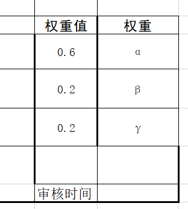
   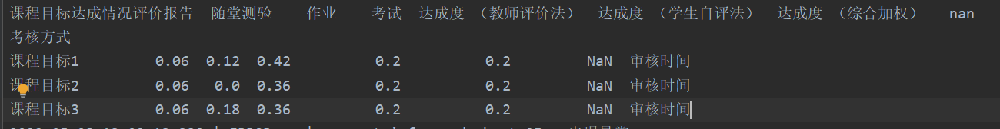
   
   权重值获取失败：修改程序后可正确读取
### (2)
   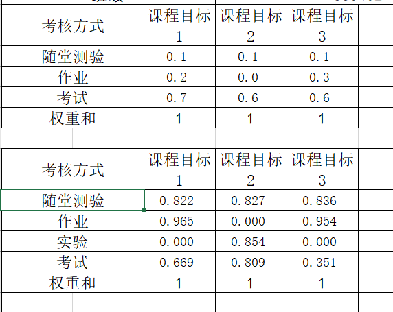
   
   考核方式个数不一致。导致读取页帧个数出现问题
   修改了主观评价页帧个数获取方式，已解决
## 2.索佳峰同学表格
   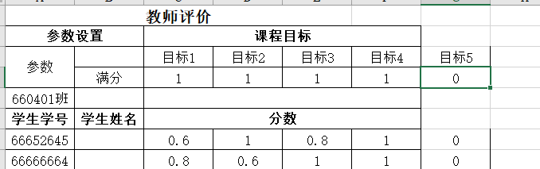
   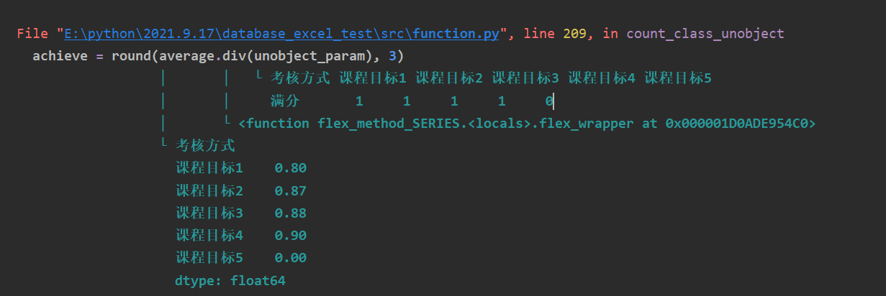
   
   计算达成度时，被除数出现0值导致程序无法运行
## 3.张振伟同学表格
   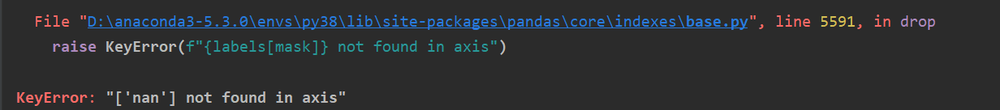
   
   删除了考试页帧，导致程序遍历了所有页帧也无法找到班级列而无法运行